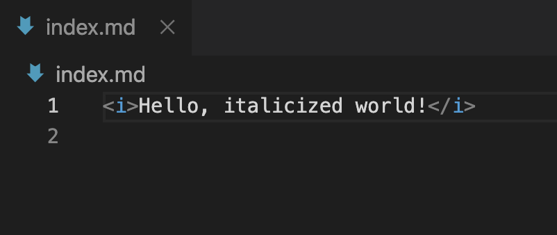

*Hello, italicized world!*<br>
**Hello, bold world!**<br>
# Title<br>
## Subtitle<br>
[Lab 1](https://maxrivett.github.io/cse15l-lab-reports/lab-report-1-week-2)<br><br>
[Lab 2](https://maxrivett.github.io/cse15l-lab-reports/lab-report-2-week-4)<br><br>
[Lab 3](https://maxrivett.github.io/cse15l-lab-reports/lab-report-3-week-6)<br><br>
My code before I learned some markdown tricks
<br>
> "Random quote."<br>
* List<br>
* Of<br>
* Stuff<br>
1. An
2. Ordered
3. List<br>

---
`Inline code!`
```
My code block.
Very cool stuff.
```