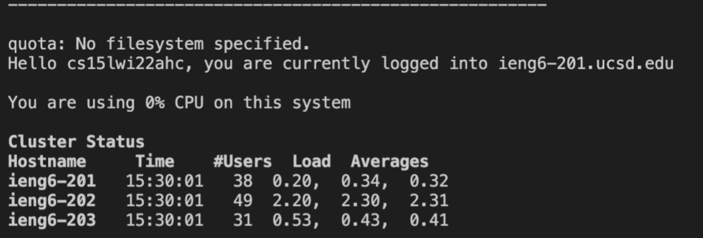

# Lab Report 1, Week 2

*Below is a tutorialon how to set up a remote connection.* 
 
1. Installing VSCode
  
To download Visual Studio Code (VSCode), you’re going to want to head to https://code.visualstudio.com/download and select the download option that serves your computing needs. From there it is pretty self-explanatory, with the software showing you the way.

  
2. Remotely Connecting
  To remotely connect, open up the terminal feature within VSCode and enter the command `ssh cs15lwi22___@ieng6.ucsd.edu` where `___` are your three (or two) unique characters that can be found on https://sdacs.ucsd.edu/~icc/index.php. You will then be prompted to input your password connected to your UCSD account. You will then see this screen: 
   
3. Trying Some Commands
  Next we’ll try some commands. Some basic commands are `cd` (change directory), `pwd` (print working directory), and `ls` (lists all files/folders) in current directory. In this case I chose to use `ls` to see the files, and saw perl5.   

4. Moving Files with scp
  You can use `scp` (or secure copy) to copy files between your local computer (the client) whose screen you’re looking at right now and the remote computers stored in a UCSD basement. However you cannot use `scp` to copy files from the remote computer to your local machine. Type `scp` then the file you’d like to copy, then the address that we used earlier to SSH. You will be prompted to enter a password unless you’ve set up an SSH key (foreshadowing).   

5. Setting an SSH Key
  To generate an SSH key, enter the command `ssh-keygen` into the console on your client. Then SSH into the remote computer and enter the command `mkdir .ssh` which copies the public key to the .ssh directory. Now you will be able to `scp` and `ssh` without entering a password.   

6. Optimizing Remote Running
  
There are many things that can be done to make remote running more efficient. An example of this is including the command in the same line as you SSH into a remote computer, like this: `ssh cs15lwi22___@ieng6.ucsd.edu “cd randomFolder”`. My personal favourite shortcut however is executing two commands in one line using semi-colons, like this: 
   