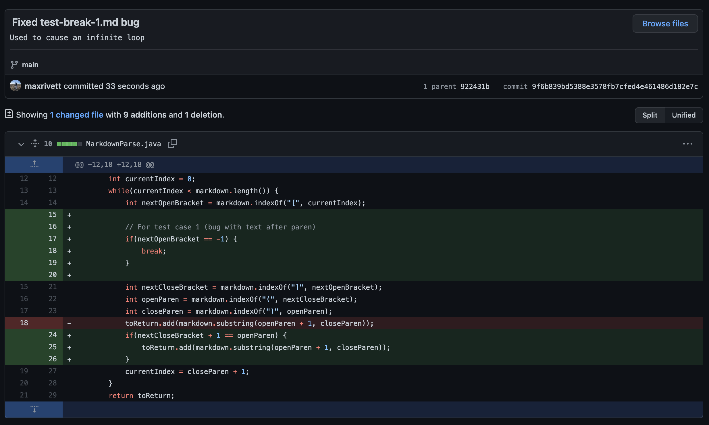
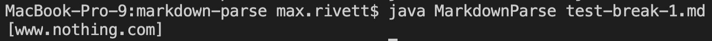
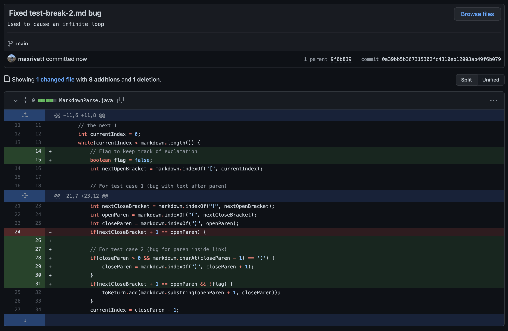
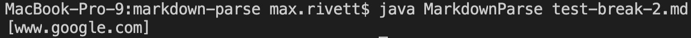
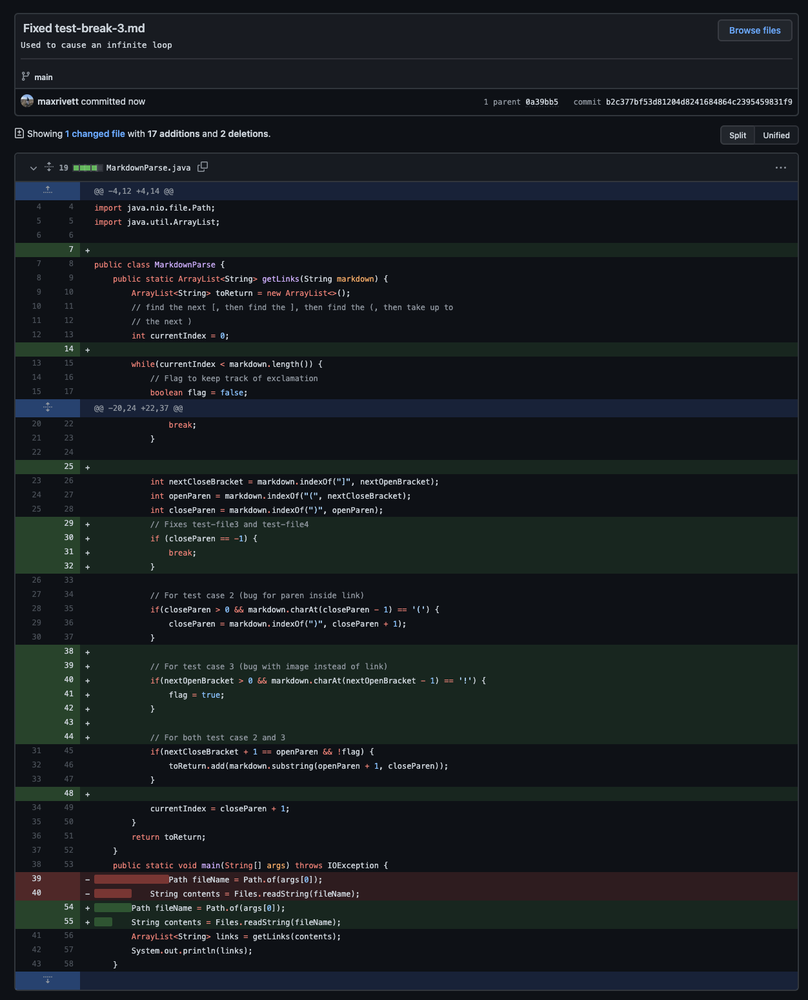
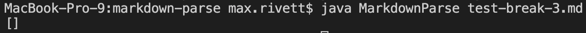

# Lab Report 2, Week 4

*In this lab report I will be showcasing three code changes I made to fix bugs in the initial code we were given.*
  
For each code change, I will...
 
* Show a screenshot of the code change diff from Github (a page like this)
* Link to the test file for a failure-inducing input that prompted you to make that change
* Show the symptom of that failure-inducing input by showing the output of running the file at the command line for the version where it was failing (this should also be in the commit message history)
* Write 2-3 sentences describing the relationship between the bug, the symptom, and the failure-inducing input.
 
---
  
1. Here is a screenshot of the code change diff from Github:

 [Test File for Break 1](lab-report-2-files/test-break-1.md)
 
Here is an example of the output before I fixed the bug:

And after I fixed the bug:

  
2. Here is a screenshot of the code change diff from Github:

 [Test File for Break 2](lab-report-2-files/test-break-2.md)
 
Here is an example of the output before I fixed the bug:

And after I fixed the bug:

  
3. Here is a screenshot of the code change diff from Github:

 [Test File for Break 3](lab-report-2-files/test-break-3.md)
 
Here is an example of the output before I fixed the bug:

And after I fixed the bug:

  