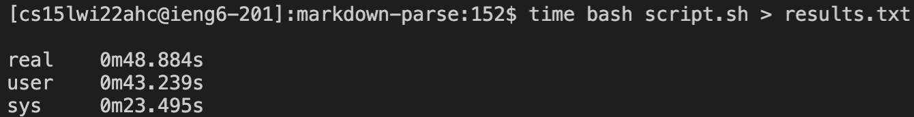

# Lab Report 5, Week 10

*In this lab report, I will be choosing 2 of the 652 commonmark-spec tests where my group's implementation of markdown-parse had a different result than the implementation provided. Then I'll compare them and see which implementation handled the test better and why.*
  
**Tests I Chose:**
 
I chose to analyze tests number 142 and 143 (corresponding to `142.md` and `143.md`).
  
**How I Found Them:**
 
I found them by comparing the results of running the script file on my `markdown-parse` and the course staff's `markdown-parse`. I used `time bash script.sh`:
 
Then I put it in a text file `results.txt` by using output redirection: 
   
Then I used the `diff` command to see how the results differed:  
As you can see, the 98th line and the 100th line yielded different results, so I investigated... 
 
I found that line 98 corresponded with test file `142.md` and 100 with `143.md`
  
**How They're Different:**
 
As you can see above, my implementation says that the is a link "x" in both of the files, whereas the course staff's implementation does not show a link.
 
Here is the code for the two files:

 
I found this by accessing the files through vim.

  
**Which Implementation (if either) is Correct?**
 
For Test 142:
Looking at the code, the **course staff's implementation is definitely correct**. There is no link in this file, and yet my implementation shows there being one.

 
For Test 143:
Looking at the code, the **course staff's implementation is definitely correct**. There is no link in this file, and yet my implementation shows there being one.
  
Here is my code: 

 
I think the problem is that my implementation does not check if there are square brackets before the parentheses, which allows something like this to happen. I think that would be a relatively quick fix, involving adding a check that there is an open and closed square bracket before the parentheses.
  
*Thanks for reading and have a nice spring break!*